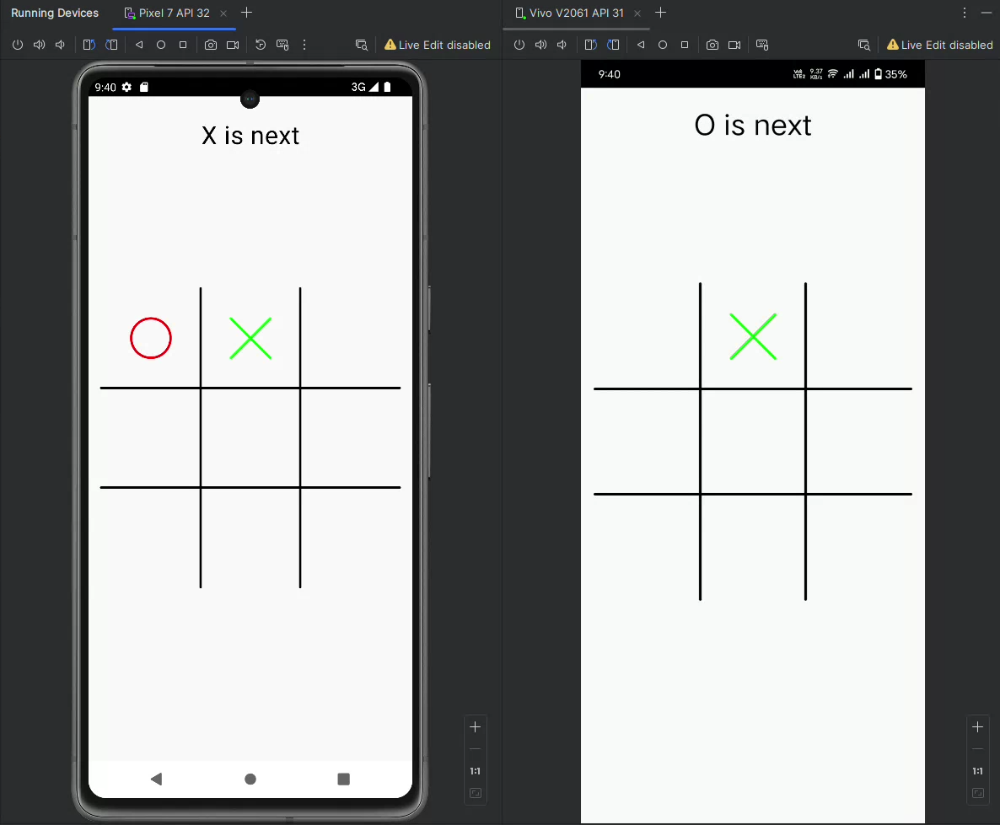
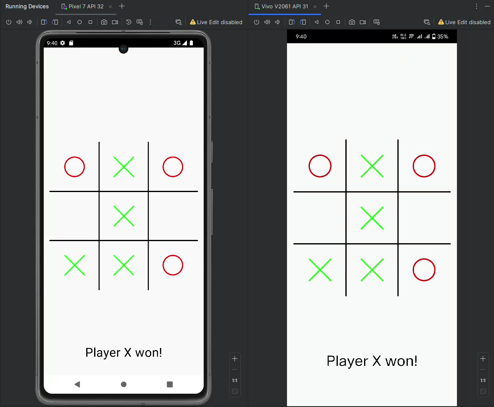

# Tic-Tac-Toe App with Ktor WebSocket API

This is a simple real-time Tic-Tac-Toe game built using Kotlin, Jetpack Compose for the UI, and Ktor WebSockets for real-time communication. The app follows the MVVM architecture and uses Dagger Hilt for dependency injection.

## Features

- Real-time multiplayer Tic-Tac-Toe game.
- WebSocket-based communication for sending and receiving game state.
- Customizable player colors (Green for Player X, Red for Player O).
- Touch gestures for making moves on the Tic-Tac-Toe board.
- Responsive design with Jetpack Compose.
- State management handled by ViewModel with real-time game state updates.

## Screenshots

## Tech Stack

- **Kotlin** - Main language for the app.
- **Jetpack Compose** - Modern UI toolkit for building native Android UI.
- **Ktor WebSocket** - For real-time messaging using WebSockets.
- **MVVM Architecture** - Organizes the app's structure into ViewModel, Model, and View.
- **Dagger Hilt** - Dependency injection for simplifying app initialization.
- **Coroutines & Flow** - For managing asynchronous tasks and streams of data.
- **Kotlinx Serialization** - For JSON encoding and decoding.

## How to Play

1. When the app starts, it connects to the WebSocket server for real-time communication.
2. You can tap on any cell to make a move, and the game will update the board based on the current game state.
3. Players are represented as X and O, with Player X having the color green and Player O having the color red.
4. The game will automatically detect the winner or when a tie occurs.

## WebSocket Communication

- The app communicates with a WebSocket server at `ws://your-server-url/play`.
- The server sends and receives game state data in JSON format.
- Each player's move is sent as an action (`MakeTurn`) to the server, and the server broadcasts the updated game state to all clients.

## Code Overview

- **`KtorRealtimeMessagingClient`**: Handles WebSocket connections, sending moves, and receiving game state updates.
- **`TicTacToeField`**: Composable function that draws the Tic-Tac-Toe board and handles user interactions.
- **`TicTacToeVM`**: ViewModel that manages the game state, initiates WebSocket communication, and handles user actions.
- **`AppModule`**: Provides dependencies like the `HttpClient` and `RealTimeMessagingClient` using Dagger Hilt.
- **`TicTacToeApp`**: Main application class annotated with `@HiltAndroidApp` to enable Dagger Hilt.

## API for Real-Time Communication

This app uses a Ktor API for WebSocket communication. The API is responsible for broadcasting the game state to all players and handling incoming messages to update the game. You can find the Ktor API used in this app by [clicking here](https://github.com/tariqjamel/Ktor-TicTacToe-API).

## Contributing

Contributions are welcome! If you have any suggestions, bug fixes, or feature implementations, please submit a pull request.

